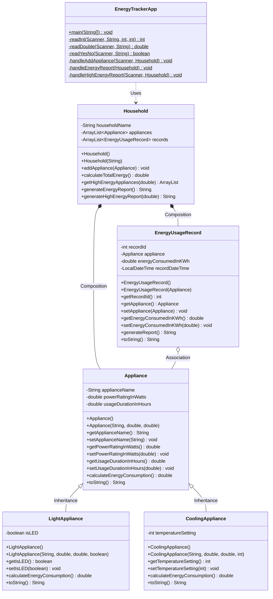

# 1. Introduction

## 1.1 Background and Motivation

In Malaysia, the weather is hot and humid for most of the year. Because of this, almost every household relies heavily on air conditioning and fans to stay comfortable. The problem is that running these appliances for long hours every day leads to very high electricity bills from TNB (Tenaga Nasional Berhad). Most people only realize how much energy they are using when the bill arrives at the end of the month -- and by then, it is too late to do anything about it.

This is what motivated our team to build the **Household Energy Consumption Tracker**. We wanted to create a simple Java program that helps users understand how much energy each of their appliances is using, so they can make better decisions about their energy habits before the bill comes.

## 1.2 Connection to SDG 7

Our project is linked to **United Nations Sustainable Development Goal 7: Affordable and Clean Energy**. SDG 7 aims to make sure everyone has access to affordable, reliable, and modern energy. One way to support this goal is by reducing unnecessary energy waste at the household level. Our program helps with this by tracking how much energy each appliance uses and showing users which appliances are consuming the most. It also encourages the use of energy-efficient options like LED lights, which our program simulates with a 20% energy discount.

## 1.3 Main Objectives

Our program has three main objectives:

1. **Record and calculate household energy consumption** -- Allow users to add different types of appliances (general, lighting, cooling) and automatically calculate how much energy each one uses in kilowatt-hours (kWh).
2. **Identify high-energy-consuming appliances** -- Let users set an energy threshold and filter out the appliances that use more than that amount, so they know which ones to target for energy saving.
3. **Raise energy-saving awareness** -- Show users how switching to LED lights and setting air conditioners to 24 degrees or above can reduce their energy usage, supporting the goals of SDG 7.

---

---

# 2. Problem Description

## 2.1 Problem Statement

Every household in Malaysia receives a monthly electricity bill from TNB. But the bill only shows one total number -- it does not break down how much each appliance used. So most people have no idea whether it is their air conditioner, their old refrigerator, or their water heater that is eating up most of the electricity. Without this information, they cannot make smart decisions about where to cut back.

## 2.2 Why This Matters and Our Computational Solution

High energy consumption is not just a money problem -- it is also an environmental one. The more electricity we waste, the more fossil fuels get burned to generate it. To solve this, our team built a Java program that takes the power rating (in watts) and usage duration (in hours) of each appliance and calculates its energy consumption using the formula: **Energy (kWh) = Power (W) x Duration (h) / 1000**. This turns something abstract ("I think my AC uses a lot of power") into a concrete number that users can compare and act on.

## 2.3 Target Audience

Our program is designed for three types of users:

- **Regular households** -- families who want to understand and reduce their monthly electricity bills.
- **University students living off-campus** -- students who rent rooms or apartments and share utility bills, so knowing which appliance uses the most helps split costs fairly.
- **Environmentally conscious individuals** -- people who care about sustainability and want to track their carbon footprint by monitoring energy usage.

---

---

# 3. Application Design (20 marks)

## 3.1 Object-Oriented Design Principles

In this project, our team applied three main OOP principles: **Encapsulation**, **Inheritance**, and **Polymorphism**. We also used the **Composition** pattern to keep our code organized. Below we explain how we used each one, with references to our actual source code.

---

### 3.1.1 Encapsulation (Data Protection)

We used Encapsulation to make sure that the data inside our objects is safe from being changed incorrectly. In every class we wrote, all instance variables are set to `private`. This means no other class can directly access or change these values. If they want to read or update a value, they have to go through our public **getter** and **setter** methods.

What makes our setter methods different from basic ones is that we added **data validation** inside them. We did not just assign values -- we checked them first. Here is a summary of what each setter checks:

| Class | Setter Method | What it checks |
|-------|--------------|----------------|
| `Appliance` | `setApplianceName(String)` | Makes sure the name is not `null` or empty. Throws `IllegalArgumentException` if it is. |
| `Appliance` | `setPowerRatingInWatts(double)` | Makes sure the power is not negative (must be >= 0). |
| `Appliance` | `setUsageDurationInHours(double)` | Makes sure the duration is not negative (must be >= 0). |
| `CoolingAppliance` | `setTemperatureSetting(int)` | Only allows temperatures between 16 and 30 degrees Celsius. |
| `Household` | `setHouseholdName(String)` | Makes sure the household name is not `null` or empty. |
| `EnergyUsageRecord` | `setEnergyConsumedInKWh(double)` | Makes sure energy values are not negative. |

One thing our group decided early on is that the **constructors should call these setter methods** instead of assigning values directly. For example, in our `Appliance.java`:

```java
public Appliance(String applianceName, double powerRatingInWatts, double usageDurationInHours) {
    setApplianceName(applianceName);         // Validation applied here
    setPowerRatingInWatts(powerRatingInWatts); // Validation applied here
    setUsageDurationInHours(usageDurationInHours); // Validation applied here
}
```

We did it this way so that the validation runs no matter how the object is created -- whether it is through the constructor or later through a setter. This way, the object always protects its own data.

---

### 3.1.2 Inheritance (Code Reuse and Hierarchy)

Our team set up a parent-child relationship between the classes using the `extends` keyword. The structure looks like this:

```
Appliance             (Parent / Superclass)
   |-- LightAppliance      (Child / Subclass)
   |-- CoolingAppliance     (Child / Subclass)
```

**What the child classes get from the parent:**

The `Appliance` class has three shared attributes that both subclasses inherit automatically:

- `applianceName` (String) -- the name of the appliance
- `powerRatingInWatts` (double) -- how much power it uses in watts
- `usageDurationInHours` (double) -- how many hours it is used

It also has a base method `calculateEnergyConsumption()`. This method uses the formula: Energy (kWh) = Power (W) x Duration (h) / 1000.

**What the child classes add on their own:**

Each child class has its own extra attribute:

- `LightAppliance` adds `boolean isLED` -- this tells us if the light is an energy-saving LED or not.
- `CoolingAppliance` adds `int temperatureSetting` -- this is the AC temperature in degrees Celsius.

**How we used `super()` in the constructors:**

In both child class constructors, we call `super()` to pass the shared attributes up to the parent. This way, the parent's setter validation still runs, and we don't copy-paste the same checks. Here is an example from `LightAppliance.java`:

```java
// In LightAppliance.java
public LightAppliance(String applianceName, double powerRatingInWatts,
                      double usageDurationInHours, boolean isLED) {
    super(applianceName, powerRatingInWatts, usageDurationInHours); // Delegates to Appliance
    this.isLED = isLED;
}
```

Because of this IS-A relationship (a `LightAppliance` IS-A `Appliance`), we can store subclass objects in a parent-type variable or collection. This turns out to be very important for polymorphism, which we explain next.

---

### 3.1.3 Polymorphism (Dynamic Behaviour) -- Key Feature

This is probably the most important OOP feature in our project. Both `LightAppliance` and `CoolingAppliance` **override** the `calculateEnergyConsumption()` method from the parent class, each with their own special logic:

- **LightAppliance**: If `isLED` is `true`, we multiply the base energy by **0.8**. This gives a 20% saving, which simulates how LED lights are more efficient in real life.
- **CoolingAppliance**: If `temperatureSetting` is below **24 degrees**, we multiply the base energy by **1.2**. This adds a 20% penalty because lower AC temperatures use more power.

Both of these overridden methods first call `super.calculateEnergyConsumption()` to get the base value, and then apply their own modifier on top.

**How we used Dynamic Polymorphism in `Household.calculateTotalEnergy()`:**

In the `Household` class, we store all the appliances in an `ArrayList<Appliance>`. Notice that the list type is the **superclass** -- `Appliance`, not `LightAppliance` or `CoolingAppliance`. So when we add a `LightAppliance` object into this list, it gets **upcast** to `Appliance` automatically.

When we want to calculate the total energy for the whole household, we just loop through the list with a basic `for` loop:

```java
// In Household.java - calculateTotalEnergy()
for (int i = 0; i < appliances.size(); i++) {

    // Step 1 - UPCASTING: access via superclass reference
    Appliance currentAppliance = appliances.get(i);

    // Step 2 - DYNAMIC DISPATCH: JVM calls the correct overridden method
    //          based on the ACTUAL type of the object at runtime
    double energy = currentAppliance.calculateEnergyConsumption();

    totalEnergy = totalEnergy + energy;
}
```

Here is what happens: even though `currentAppliance` is declared as type `Appliance`, the actual object behind it might be a `LightAppliance` or a `CoolingAppliance`. When we call `calculateEnergyConsumption()`, Java does not just run the parent version. Instead, the JVM looks at the **actual type** of the object at runtime and picks the right overridden version. This is called **dynamic method dispatch**. So:

- If the object is actually a `LightAppliance` with LED on, the LED-discounted version runs.
- If it is a `CoolingAppliance` set below 24 degrees, the penalty version runs.
- If it is just a plain `Appliance`, the base formula runs.

The nice thing about this is that we only need **one loop** to handle all different types. We do not need any `if-else` or `instanceof` to check what type each appliance is before calculating. The JVM handles it for us. This also means if we ever add a new subclass in the future (like a `HeatingAppliance`), we would not need to change this loop at all -- it would just work.

---

### 3.1.4 Class Interaction (Composition and Separation of Concerns)

Our team organized the classes using **Composition** (HAS-A relationships) instead of putting everything in one big class. The flow looks like this:

```
EnergyTrackerApp  --uses-->  Household  --owns-->  ArrayList<Appliance>
       (UI layer)              (Business logic)       (Data layer)
```

**How our Main class works with the Household class:**

1. When the program starts, `EnergyTrackerApp` creates one `Household` object. The main class does **not** touch the `ArrayList<Appliance>` directly at all.
2. When the user wants to add an appliance, the main class collects the input using `Scanner`, creates the right type of object, and then calls `household.addAppliance(newAppliance)`. The Household handles the storage.
3. When the user wants to see the energy report, the main class just calls `household.generateEnergyReport()` and prints whatever string it returns. All the calculation and formatting happens inside `Household`.
4. Same for the high-energy filter -- the main class calls `household.generateHighEnergyReport(threshold)`.

We did it this way because we wanted each class to have only one job. This is sometimes called the **Single Responsibility Principle (SRP)**:

| Class | What it does |
|-------|-------------|
| `EnergyTrackerApp` | Only handles user input and output (Scanner menu, printing results). |
| `Household` | Handles all the business logic (managing appliances, calculating energy, making reports). |
| `Appliance` and subclasses | Holds data and calculates individual energy consumption. |
| `EnergyUsageRecord` | Logs energy data with a timestamp. |

So the main class never does any calculations or data work. It is just the bridge between the user and the `Household` object.

---

### 3.2 Class Diagram



---

---

# 4. Implementation (20 marks)

## 4.1 Programming Language and Environment

Our team chose **Java (JDK 8)** to build this project. We picked Java mainly because it has built-in support for OOP. Everything in Java is based on classes and objects, so it was a natural fit for an OOP assignment. Besides that, Java has strict type checking at compile time, which helped us catch bugs early. It also runs on any platform with a JVM, so any group member could compile and test the code on their own machine.

We used **Visual Studio Code** with the Java Extension Pack as our IDE. For version control, we used **Git** and hosted the repository on **GitHub** so that all five members could work together. We compiled the code using the `javac` command in the terminal.

| Component | Detail |
|-----------|--------|
| **Programming Language** | Java (JDK 8) |
| **IDE** | Visual Studio Code with the Java Extension Pack |
| **Version Control** | Git, hosted on GitHub |
| **Build Method** | Command-line compilation using `javac` |
| **Operating System** | Windows |

---

## 4.2 Key Code Snippets Showing OOP Features

Below we show some key parts of our code that demonstrate the three OOP principles. We only included the relevant lines -- we did not put full class code here.

---

### 4.2.1 Encapsulation

**From `Appliance.java` -- private attributes and setter validation:**

```java
// All attributes are declared 'private' -- other classes cannot touch them directly
private String applianceName;
private double powerRatingInWatts;
private double usageDurationInHours;

// Setter with data validation -- checks before assigning
public void setPowerRatingInWatts(double powerRatingInWatts) {
    if (powerRatingInWatts < 0) {
        throw new IllegalArgumentException(
                "Power rating cannot be negative. Received: " + powerRatingInWatts);
    }
    this.powerRatingInWatts = powerRatingInWatts;
}

public void setApplianceName(String applianceName) {
    if (applianceName == null || applianceName.trim().isEmpty()) {
        throw new IllegalArgumentException("Appliance name cannot be null or empty.");
    }
    this.applianceName = applianceName.trim();
}
```

**What this shows:** We declared all our variables as `private`, so nothing outside the class can directly read or change them. The only way to update them is through our setter methods. And our setters do not just blindly accept any value -- they check the input first. For example, `setPowerRatingInWatts()` checks if the number is negative. If someone tries to pass in `-100`, it throws an `IllegalArgumentException` instead of accepting bad data. We also made our constructors call these setters (like `setApplianceName(applianceName)` instead of `this.applianceName = applianceName`), so the validation always runs, no matter how the object gets created.

---

### 4.2.2 Inheritance

**From `LightAppliance.java` -- using `extends` and `super()`:**

```java
public class LightAppliance extends Appliance {

    // Extra private attribute only for this subclass
    private boolean isLED;

    // Constructor -- passes shared attributes to parent using super()
    public LightAppliance(String applianceName, double powerRatingInWatts,
                          double usageDurationInHours, boolean isLED) {
        super(applianceName, powerRatingInWatts, usageDurationInHours);
        this.isLED = isLED;
    }

    // Override -- different calculation for light appliances
    @Override
    public double calculateEnergyConsumption() {
        double baseEnergy = super.calculateEnergyConsumption();
        if (isLED) {
            return baseEnergy * 0.8;  // LED lights save 20% energy
        } else {
            return baseEnergy;
        }
    }
}
```

**What this shows:** We used the `extends` keyword to make `LightAppliance` a child of `Appliance`. This means `LightAppliance` automatically gets all the parent's attributes and methods -- we did not need to rewrite them. In the constructor, we used `super()` to send the shared data up to the parent's constructor, so the parent's validation logic still runs. Then we added our own attribute (`isLED`) on top. We also overrode `calculateEnergyConsumption()` -- our version first calls `super.calculateEnergyConsumption()` to get the base energy, and then applies a 20% discount if the light is LED. Our `CoolingAppliance` works the same way, but it adds a `temperatureSetting` and increases energy by 20% when the temperature is set below 24 degrees.

---

### 4.2.3 Polymorphism (Dynamic Behaviour)

**From `Household.java` -- dynamic method dispatch using a superclass list:**

```java
// The ArrayList uses the SUPERCLASS type (Appliance).
// It can hold Appliance, LightAppliance, or CoolingAppliance objects.
private ArrayList<Appliance> appliances;

public double calculateTotalEnergy() {
    double totalEnergy = 0.0;

    for (int i = 0; i < appliances.size(); i++) {
        // UPCASTING: 'currentAppliance' is the superclass type (Appliance),
        // but the real object could be any subclass.
        Appliance currentAppliance = appliances.get(i);

        // DYNAMIC DISPATCH: the JVM picks the right version of
        // calculateEnergyConsumption() based on the ACTUAL type at runtime.
        double energy = currentAppliance.calculateEnergyConsumption();

        totalEnergy = totalEnergy + energy;
    }

    return totalEnergy;
}
```

**What this shows:** This is where dynamic polymorphism really happens in our project. We stored all our appliances in one `ArrayList<Appliance>`, using the parent type. So when we add a `LightAppliance` or `CoolingAppliance` into this list, it gets **upcast** to `Appliance`.

Now, in the `for` loop, `currentAppliance` is declared as `Appliance`. But the actual object behind it could be anything -- a `LightAppliance`, a `CoolingAppliance`, or a plain `Appliance`. When we call `currentAppliance.calculateEnergyConsumption()`, the JVM does not just run the parent's version. It looks at what the object **actually is** at runtime and calls the right overridden method. This is called **dynamic method dispatch**.

So if the object is really a `LightAppliance` with LED on, the LED-discount version runs. If it is a `CoolingAppliance` below 24 degrees, the penalty version runs. We get different results from the same method call, and we did not need any `if-else` or `instanceof` to make this work. That is the whole point of polymorphism -- one loop, one method call, different behaviour depending on the object.

If we ever add a new type of appliance (like a `HeatingAppliance`), we would not need to touch this loop. It would just pick up the new subclass's method automatically.

---

## 4.3 Execution and User Input/Output Handling

Our main class `EnergyTrackerApp` handles all the user interaction. We used `java.util.Scanner` to read input from the console. The program shows a menu with four choices (add appliance, view report, view high-energy appliances, exit) and keeps looping until the user picks exit.

**How we handled bad input:**

One thing we were careful about is making sure the program does not crash when the user types something wrong. We wrote helper methods like `readInt()`, `readDouble()`, and `readYesNo()` that use `try-catch` and `while` loops to keep asking until the user gives valid input.

**From `EnergyTrackerApp.java` -- handling invalid input with `try-catch`:**

```java
private static int readInt(Scanner scanner, String prompt, int min, int max) {
    int value = 0;
    boolean validInput = false;

    while (!validInput) {
        System.out.print("  " + prompt);
        try {
            String input = scanner.nextLine().trim();
            value = Integer.parseInt(input);

            if (value >= min && value <= max) {
                validInput = true;
            } else {
                System.out.println("  [Invalid] Please enter a number between "
                        + min + " and " + max + ".");
            }
        } catch (NumberFormatException e) {
            System.out.println("  [Invalid] That is not a valid number. Please try again.");
        }
    }
    return value;
}
```

**What this shows:** We used `Integer.parseInt()` inside a `try` block. If the user types something that is not a number (like "abc" or special characters), Java throws a `NumberFormatException`. We catch that error and just print a message telling the user to try again. The `while` loop keeps going until we get a valid number in the right range. We used the same idea for `readDouble()` and `readYesNo()`.

On top of that, we wrapped the entire `main()` method in a `try-catch(Exception)` block with a `finally` part. The `finally` makes sure the `Scanner` always gets closed, even if something unexpected goes wrong. This way the program never just crashes on the user -- it always shows a message and exits cleanly.

---

---

# 5. Output and Testing (10 marks)

## 5.1 Testing Strategy and Sample Inputs

Our team used **black-box testing** to test the program. What this means is that we tested it from the user's point of view -- we did not look at the internal code while testing. We just ran the program, typed in different inputs, and checked if the output matched what we expected.

We mainly focused on two things:
- **Valid inputs** -- to make sure the normal features work correctly (adding appliances, calculating energy, etc.).
- **Invalid inputs** -- to make sure the program does not crash when the user types something wrong (like letters instead of numbers, or negative values).

Here are four of our main test cases:

| Test ID | Description | Sample Input | Expected Outcome | Pass/Fail |
|---------|------------|-------------|-----------------|-----------|
| TC-01 | Add a general appliance with valid data | Name: "Ceiling Fan", Power: 75 W, Duration: 8 h | Appliance added successfully. Energy = 0.6000 kWh. | Pass |
| TC-02 | Test encapsulation: enter negative power rating | Name: "Broken Item", Power: -50 W | Program shows error: "Power rating cannot be negative" and does not add the appliance. | Pass |
| TC-03 | Test polymorphism: add an LED light and check energy discount | Name: "Desk Lamp", Power: 60 W, Duration: 5 h, LED: yes | Energy = 0.2400 kWh (base 0.3000 x 0.8 = 20% LED discount applied). | Pass |
| TC-04 | Test invalid input: type letters instead of a number for menu choice | Input: "abc" when asked for menu choice (1-4) | Program shows "[Invalid] That is not a valid number. Please try again." and asks again. No crash. | Pass |

All four test cases passed. We also tested edge cases like entering 0 for power and 0 for duration, which should give 0 kWh -- and it did.

---

## 5.2 Console Results (Sample Output)

Since we cannot attach screenshots in this format, we have copied the actual console output below.

**Test Run 1 -- Normal usage: adding appliances and viewing the energy report**

```
============================================================
       HOUSEHOLD ENERGY CONSUMPTION TRACKER
            SDG 7: Clean Energy
------------------------------------------------------------
   Track your appliances. Save energy. Save the planet.
============================================================

------------------------------------------------------------
                    MAIN MENU
------------------------------------------------------------
   1.  Add an Appliance
   2.  Record & View Total Energy Consumption
   3.  View High Energy Consumption Appliances
   4.  Exit Program
------------------------------------------------------------
  Please enter your choice (1-4): 1

------------------------------------------------------------
              ADD A NEW APPLIANCE
------------------------------------------------------------
   Select appliance type:
   1. General Appliance
   2. Light Appliance
   3. Cooling Appliance (e.g., Air Conditioner)
- - - - - - - - - - - - - - - - - - - - - - - - - - - - - -
  Your choice (1-3): 2

- - - - - - - - - - - - - - - - - - - - - - - - - - - - - -
   Enter appliance details:
- - - - - - - - - - - - - - - - - - - - - - - - - - - - - -
  Appliance name: Desk Lamp
  Power rating (Watts, >= 0): 60
  Usage duration (Hours, >= 0): 5
  Is this an LED light? (yes/no): yes

- - - - - - - - - - - - - - - - - - - - - - - - - - - - - -
   [SUCCESS] Appliance added successfully!
- - - - - - - - - - - - - - - - - - - - - - - - - - - - - -
   LightAppliance [Name: Desk Lamp, Power: 60.00 W, Duration: 5.00 h, LED: Yes, Energy: 0.2400 kWh]
   Total appliances in household: 1
------------------------------------------------------------

------------------------------------------------------------
                    MAIN MENU
------------------------------------------------------------
   1.  Add an Appliance
   2.  Record & View Total Energy Consumption
   3.  View High Energy Consumption Appliances
   4.  Exit Program
------------------------------------------------------------
  Please enter your choice (1-4): 1

------------------------------------------------------------
              ADD A NEW APPLIANCE
------------------------------------------------------------
   Select appliance type:
   1. General Appliance
   2. Light Appliance
   3. Cooling Appliance (e.g., Air Conditioner)
- - - - - - - - - - - - - - - - - - - - - - - - - - - - - -
  Your choice (1-3): 3

- - - - - - - - - - - - - - - - - - - - - - - - - - - - - -
   Enter appliance details:
- - - - - - - - - - - - - - - - - - - - - - - - - - - - - -
  Appliance name: Living Room AC
  Power rating (Watts, >= 0): 1500
  Usage duration (Hours, >= 0): 10
  Temperature setting (16-30 C): 22

- - - - - - - - - - - - - - - - - - - - - - - - - - - - - -
   [SUCCESS] Appliance added successfully!
- - - - - - - - - - - - - - - - - - - - - - - - - - - - - -
   CoolingAppliance [Name: Living Room AC, Power: 1500.00 W, Duration: 10.00 h, Temp: 22°C, Energy: 18.0000 kWh]
   Total appliances in household: 2
------------------------------------------------------------

------------------------------------------------------------
                    MAIN MENU
------------------------------------------------------------
   1.  Add an Appliance
   2.  Record & View Total Energy Consumption
   3.  View High Energy Consumption Appliances
   4.  Exit Program
------------------------------------------------------------
  Please enter your choice (1-4): 2

========== ENERGY CONSUMPTION REPORT ==========
  Household: My Home
  Total Appliances: 2

  --- Appliance #1 ---
  Name           : Desk Lamp
  Power Rating   : 60.00 W
  Usage Duration : 5.00 h
  Type           : Light Appliance
  LED            : Yes (20% energy saving applied)
  Energy Used    : 0.2400 kWh

  --- Appliance #2 ---
  Name           : Living Room AC
  Power Rating   : 1500.00 W
  Usage Duration : 10.00 h
  Type           : Cooling Appliance
  Temperature    : 22 °C (20% energy penalty applied)
  Energy Used    : 18.0000 kWh

================================================
  TOTAL ENERGY CONSUMPTION : 18.2400 kWh
================================================
  SDG 7 Reminder: Use LED lights and set your
  air conditioner to 24°C or above to save energy!
================================================
```

**Test Run 2 -- Invalid input handling: the program catches errors without crashing**

```
------------------------------------------------------------
                    MAIN MENU
------------------------------------------------------------
   1.  Add an Appliance
   2.  Record & View Total Energy Consumption
   3.  View High Energy Consumption Appliances
   4.  Exit Program
------------------------------------------------------------
  Please enter your choice (1-4): abc
  [Invalid] That is not a valid number. Please try again.
  Please enter your choice (1-4): 5
  [Invalid] Please enter a number between 1 and 4.
  Please enter your choice (1-4): !@#
  [Invalid] That is not a valid number. Please try again.
  Please enter your choice (1-4): 1

------------------------------------------------------------
              ADD A NEW APPLIANCE
------------------------------------------------------------
   Select appliance type:
   1. General Appliance
   2. Light Appliance
   3. Cooling Appliance (e.g., Air Conditioner)
- - - - - - - - - - - - - - - - - - - - - - - - - - - - - -
  Your choice (1-3): 1

- - - - - - - - - - - - - - - - - - - - - - - - - - - - - -
   Enter appliance details:
- - - - - - - - - - - - - - - - - - - - - - - - - - - - - -
  Appliance name:
  [Invalid] Appliance name cannot be empty.
  Appliance name: Test Fan
  Power rating (Watts, >= 0): -200
  [Invalid] Value cannot be negative. Please try again.
  Power rating (Watts, >= 0): fifty
  [Invalid] That is not a valid number. Please try again.
  Power rating (Watts, >= 0): 50
  Usage duration (Hours, >= 0): 3

- - - - - - - - - - - - - - - - - - - - - - - - - - - - - -
   [SUCCESS] Appliance added successfully!
- - - - - - - - - - - - - - - - - - - - - - - - - - - - - -
   Appliance [Name: Test Fan, Power: 50.00 W, Duration: 3.00 h, Energy: 0.1500 kWh]
   Total appliances in household: 1
------------------------------------------------------------
```

As shown above, the program handled every invalid input correctly. It did not crash at any point. It just told the user what went wrong and asked them to try again.

---

## 5.3 Issues, Limitations, and Debugging

During the development process, our team ran into a couple of bugs and limitations. Here is what happened and how we dealt with them.

### Bug 1: The Scanner `.nextInt()` Skipping Problem

This was probably the most frustrating bug we encountered. Early in development, we were using `scanner.nextInt()` to read menu choices and `scanner.nextLine()` to read appliance names. But we noticed that after the user entered a number for the menu, the program would completely skip the next `nextLine()` call -- it would just return an empty string without waiting for input.

After some research, we found out this is a well-known Java bug. When you call `scanner.nextInt()`, it reads the number but leaves the newline character (`\n`) in the input buffer. So when `scanner.nextLine()` runs next, it immediately reads that leftover newline and returns an empty string.

**How we fixed it:** We decided to stop using `nextInt()` and `nextDouble()` entirely. Instead, we read everything as a string using `scanner.nextLine()`, and then convert it to a number using `Integer.parseInt()` or `Double.parseDouble()`. This way, the newline is always consumed, and we never have the skipping problem. It also made our `try-catch` error handling easier, because `parseInt()` throws a clean `NumberFormatException` that we can catch.

### Bug 2: toString() Showing Wrong Energy for Subclasses

Another bug we found was that when we first wrote the `toString()` method in `LightAppliance`, we accidentally used `super.calculateEnergyConsumption()` in the format string instead of `calculateEnergyConsumption()`. This meant the printed energy value did not include the 20% LED discount, even though the actual calculation was correct internally. The numbers in the report were right, but the `toString()` output was showing the wrong value.

We caught this during testing when we compared the energy value printed by `toString()` with the value in the energy report. They did not match, so we traced it back to the `toString()` method and fixed it to call `this.calculateEnergyConsumption()` (or just `calculateEnergyConsumption()` without `super`).

### Limitation: No Data Persistence

One limitation of our current program is that it does not save any data. Once the user closes the program, all the appliances and energy records are lost. Everything is stored in `ArrayList` objects in memory, so nothing survives after the program exits.

We are aware that this could be solved by using **File I/O** (writing data to a `.txt` or `.csv` file) or even connecting to a database. However, since we have not covered File I/O in this module yet, we decided to keep it simple for now. This is something we would like to improve in a future version of the project.

---

---

# 6. Discussion and Reflection

## 6.1 Reflection on OOP

Looking back, using OOP principles really did make our code easier to manage. One thing we noticed early on is that **Encapsulation** saved us a lot of trouble. Because we put validation checks inside our setter methods, the program automatically rejects bad data like negative power values or empty names. Without that, we would have had to write `if` checks everywhere in the main class, and it would have been easy to miss one.

**Polymorphism** was the part that impressed us the most. At first, we were not sure how useful it would be. But when we saw that our `calculateTotalEnergy()` method only needed **one for loop** to handle all three types of appliances -- general, light, and cooling -- it clicked. The JVM picks the right version of `calculateEnergyConsumption()` at runtime through dynamic method dispatch, so we did not need to write separate `if-else` blocks for each appliance type. And if we ever want to add a new type of appliance in the future (like a `HeatingAppliance`), we just create a new subclass and override the method. The existing loop does not need any changes at all. That is really convenient.

## 6.2 What We Learned

Besides the OOP concepts, our team also learned some practical things during this project. The biggest one was dealing with the `Scanner` bug -- when `nextInt()` leaves a newline in the buffer and causes `nextLine()` to skip. It took us a while to figure out what was going on, but once we switched to using `nextLine()` with `Integer.parseInt()`, the problem went away completely. It was a good reminder that debugging is not just about logic errors -- sometimes the tools themselves behave in unexpected ways.

We also learned a lot about working as a team. At the start, we had some confusion about who was writing which class, and there were a few merge conflicts on GitHub. But after we split the work clearly (one person on models, one on the main class, one on testing, etc.), things went much smoother. Using Git helped us track changes and avoid overwriting each other's code.

## 6.3 Future Improvements

There are two main things we would like to add if we continue working on this project:

1. **Data persistence with File I/O** -- Right now, all the data disappears when the program closes. In the future, we want to save the appliance list to a `.txt` or `.csv` file so that users can load their data the next time they open the program. We have not learned File I/O yet in this module, but it is something we plan to study on our own.

2. **Graphical User Interface (GUI)** -- Our current program runs entirely in the console with text menus. While it works fine, it is not very user-friendly for non-technical users. In the future, we would like to replace the console interface with a simple GUI using **JavaFX**. This would make the program look more professional and easier to use, with buttons, text fields, and maybe even a chart to visualize energy consumption.

---

---

# 7. Conclusion

In conclusion, our team successfully developed a Household Energy Consumption Tracker using Java and core OOP principles. The program allows users to add different types of appliances, calculate their individual and total energy consumption, and identify which appliances are using the most electricity. We applied **Encapsulation** to protect data with validated setters, **Inheritance** to avoid repeating code across appliance types, and **Polymorphism** to let a single loop handle different appliance calculations through dynamic method dispatch. The program also handles invalid user input without crashing, which was one of our key goals.

This project is directly linked to **SDG 7: Affordable and Clean Energy**. By helping users see exactly how much energy each appliance uses, our program encourages them to switch to energy-efficient options like LED lights and to avoid setting their air conditioners too low. This reduces unnecessary energy waste at the household level.

Beyond SDG 7, our project also connects to **SDG 3: Good Health and Well-being**. In a hot country like Malaysia, cooling appliances like fans and air conditioners are not just about comfort -- they are about health. Extreme heat can cause heatstroke and other heat-related illnesses, especially for elderly family members and young children. By helping households manage their cooling appliances more efficiently, our program makes sure families can keep their homes at a safe and comfortable temperature without wasting energy. In other words, saving energy does not mean turning off the AC completely -- it means using it wisely. And that supports both clean energy and family health at the same time.

---

---

# 8. References

Liang, Y. D. (2020). *Introduction to Java programming and data structures: Comprehensive version* (12th ed.). Pearson.

Oracle. (2014). *Java Platform, Standard Edition 8 API Specification*. Oracle Corporation. https://docs.oracle.com/javase/8/docs/api/

United Nations. (n.d.). *Goal 7: Ensure access to affordable, reliable, sustainable and modern energy for all*. United Nations Department of Economic and Social Affairs, Sustainable Development. https://sdgs.un.org/goals/goal7

W3Schools. (n.d.). *Java OOP (Object-Oriented Programming)*. W3Schools. https://www.w3schools.com/java/java_oop.asp
